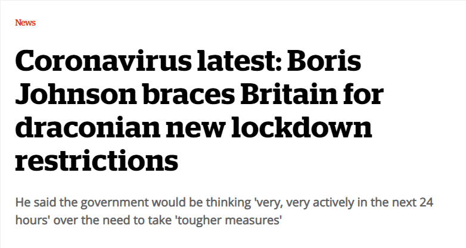
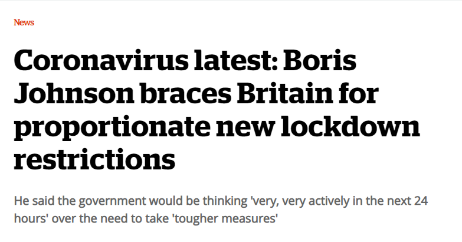
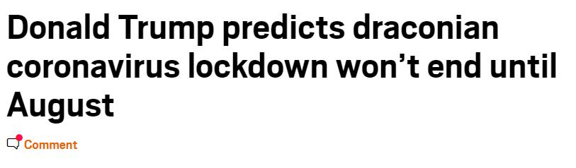
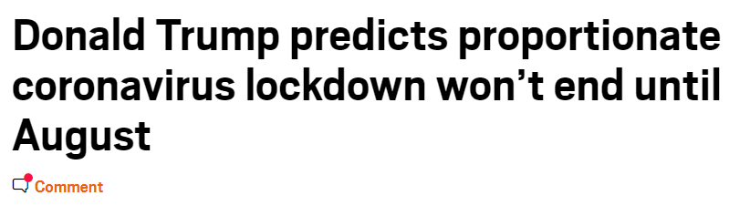

draconian to proportionate 
=============

To combat the absolute media hysteria over the entirely proportionate national responses to the COVID-19 pandemic, here is a handy Chrome extension that replaces all occurrences of 'draconian' with 'proportionate'.

[Direct download of crx file](https://github.com/lauriejy/draconian-to-proportionate/blob/master/CloudToButt.crx?raw=true)

Some recent usage examples:

_Before_

_After_

[Source](https://inews.co.uk/news/coronavirus-latest-boris-johnson-braces-britain-for-draconian-new-lockdown-restrictions-2505058)

_Before_

_After_

[Source](https://metro.co.uk/2020/03/16/donald-trump-predicts-draconian-coronavirus-lockdown-wont-end-august-12407804/)

Stay safe everyone.

https://www.who.int/emergencies/diseases/novel-coronavirus-2019/advice-for-public

Installation
------------

In Chrome, choose Window > Extensions.  Drag DraconianToProportionate.crx into the page that appears.
